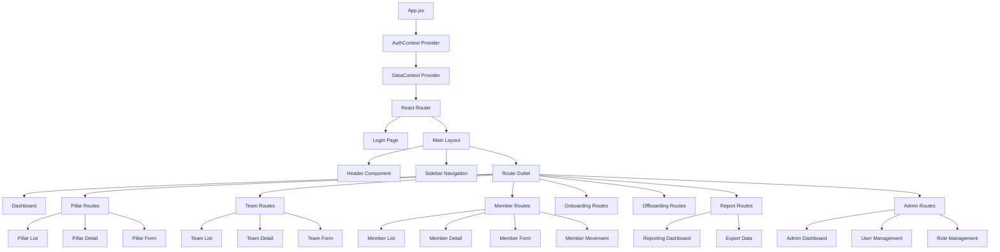
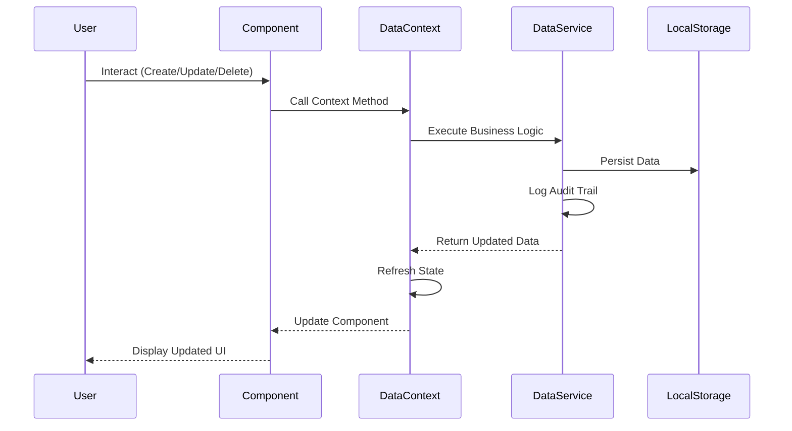
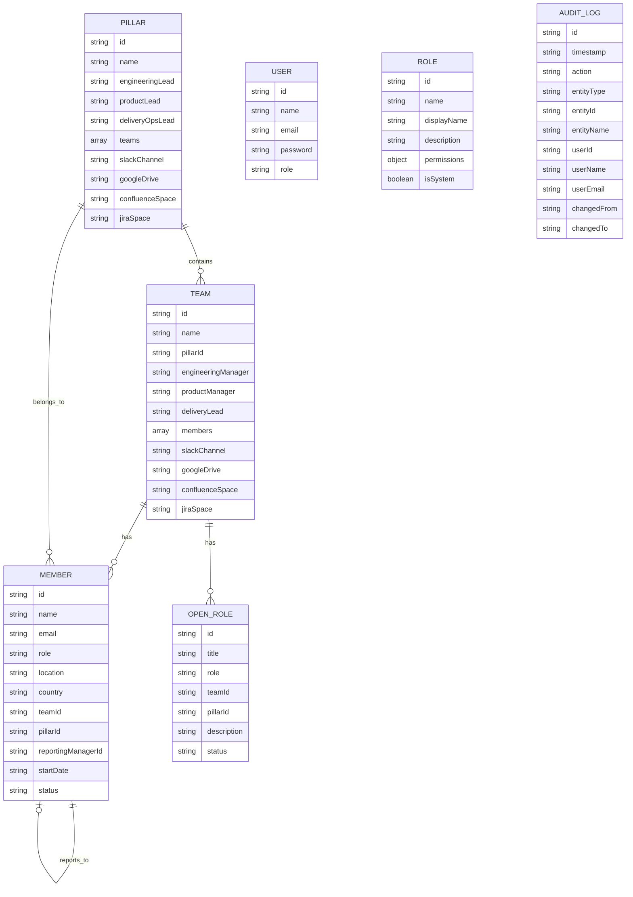

# Team Inventory System Architecture

## Overview
Team Inventory is a React-based web application for managing organizational structure, team members, onboarding/offboarding processes, and generating reports. The application uses a client-side architecture with localStorage for data persistence.

## System Architecture Diagram

```mermaid
graph TB
    subgraph "Client Application"
        subgraph "Presentation Layer"
            UI[User Interface Components]

            subgraph "Pages"
                Dashboard[Dashboard]
                Members[Members]
                Teams[Teams]
                Pillars[Pillars]
                Onboarding[Onboarding]
                Offboarding[Offboarding]
                Reports[Reports]
                Admin[Admin]
            end

            subgraph "Common Components"
                Table[Table Component]
                Modal[Modal Component]
                SearchFilter[Search & Filter]
            end

            subgraph "Layout"
                Header[Header]
                Sidebar[Fixed Sidebar]
                Layout[Layout Wrapper]
            end
        end

        subgraph "State Management"
            AuthContext[Authentication Context]
            DataContext[Data Context]
        end

        subgraph "Business Logic"
            DataService[Data Service Layer]
            ExportUtils[Export Utilities]
            MockData[Mock Data Generator]
        end

        subgraph "Data Persistence"
            LocalStorage[(localStorage)]
        end
    end

    subgraph "Routing"
        Router[React Router]
    end

    UI --> Layout
    Layout --> Header
    Layout --> Sidebar
    Layout --> Pages

    Pages --> Dashboard
    Pages --> Members
    Pages --> Teams
    Pages --> Pillars
    Pages --> Onboarding
    Pages --> Offboarding
    Pages --> Reports
    Pages --> Admin

    Dashboard --> DataContext
    Members --> DataContext
    Teams --> DataContext
    Pillars --> DataContext
    Onboarding --> DataContext
    Offboarding --> DataContext
    Reports --> DataContext
    Admin --> DataContext

    Members --> Table
    Teams --> Table
    Pillars --> Table
    Reports --> Table

    Members --> Modal
    Teams --> Modal
    Pillars --> Modal

    Members --> SearchFilter
    Teams --> SearchFilter

    DataContext --> DataService
    DataContext --> AuthContext

    DataService --> LocalStorage
    DataService --> MockData
    DataService --> ExportUtils

    Router --> Pages

    AuthContext --> LocalStorage
```

## Component Hierarchy



## Data Flow



## Key Architecture Decisions

### 1. State Management
- **Context API**: Used for global state management (Auth & Data)
- **Local State**: Component-level state for UI interactions
- **No Redux**: Simplified architecture using React Context

### 2. Data Persistence
- **localStorage**: Client-side storage for all application data
- **No Backend**: Standalone application with mock data
- **Audit Logging**: All changes tracked with user information

### 3. Component Structure
- **Page Components**: Route-level containers
- **Feature Components**: Domain-specific functionality
- **Common Components**: Reusable UI elements
- **Layout Components**: Application structure

### 4. Routing
- **React Router v6**: Client-side routing
- **Protected Routes**: Authentication-based access control
- **Nested Routes**: Hierarchical route structure

### 5. Styling
- **Tailwind CSS**: Utility-first CSS framework
- **Custom CSS**: Minimal custom styles
- **Responsive Design**: Mobile-friendly layouts

## Data Model



## Key Features

### 1. Member Management
- Create, Read, Update, Delete members
- Assign to teams and pillars
- Track reporting relationships
- Import members from CSV
- View member details and history

### 2. Team Management
- Organize teams within pillars
- Assign managers and leads
- Track team composition
- Link to collaboration tools

### 3. Onboarding/Offboarding
- Track member lifecycle
- Onboarding workflows
- Offboarding processes
- Status tracking

### 4. Reporting
- All Members Report
- Active Members Report
- Teams Overview
- Pillars Overview
- Members by Role
- Manager Direct Reports
- Audit Log
- Export to CSV/JSON

### 5. Admin Features
- User management
- Role-based permissions
- System configuration
- Audit trail

## Security Considerations

1. **Authentication**: Simple login system (development mode)
2. **Authorization**: Role-based access control
3. **Data Storage**: Client-side only (no sensitive data in production)
4. **Audit Trail**: All changes logged with user information

## Technology Stack

- **Frontend Framework**: React 19
- **Routing**: React Router DOM v7
- **State Management**: React Context API
- **Styling**: Tailwind CSS v3
- **Icons**: Lucide React
- **Build Tool**: Vite v7
- **Language**: JavaScript (ES6+)

## File Structure

```
team-inventory/
├── src/
│   ├── main.jsx                 # Application entry point
│   ├── App.jsx                  # Main app component
│   ├── components/
│   │   ├── Auth/               # Authentication components
│   │   ├── Layout/             # Layout components (Header, Sidebar)
│   │   ├── Common/             # Reusable components
│   │   ├── Dashboard/          # Dashboard components
│   │   ├── Members/            # Member management
│   │   ├── Teams/              # Team management
│   │   ├── Pillars/            # Pillar management
│   │   ├── Onboarding/         # Onboarding workflows
│   │   ├── Offboarding/        # Offboarding workflows
│   │   ├── Reports/            # Reporting & analytics
│   │   └── Admin/              # Admin panel
│   ├── context/
│   │   ├── AuthContext.jsx     # Authentication state
│   │   └── DataContext.jsx     # Application data state
│   ├── services/
│   │   └── dataService.js      # Data persistence layer
│   ├── utils/
│   │   ├── exportUtils.js      # Export functionality
│   │   └── mockData.js         # Mock data generator
│   └── assets/                 # Static assets
├── public/                     # Public static files
├── index.html                  # HTML template
├── vite.config.js             # Vite configuration
├── tailwind.config.js         # Tailwind configuration
└── package.json               # Dependencies
```

## Future Enhancements

1. **Backend Integration**: API integration for data persistence
2. **Real-time Updates**: WebSocket support for live collaboration
3. **Advanced Analytics**: More detailed reporting and visualizations
4. **File Uploads**: Support for profile pictures and documents
5. **Calendar Integration**: Onboarding/offboarding scheduling
6. **Notifications**: Email/Slack notifications for events
7. **Search Enhancement**: Full-text search across all entities
8. **Export Templates**: Customizable export formats

## Development

### Running the Application
```bash
npm install
npm run dev
```

### Building for Production
```bash
npm run build
npm run preview
```

### Resetting Data
Open browser console and run:
```javascript
localStorage.removeItem('team-inventory-data');
location.reload();
```

## Contributors

Created with Claude Code assistance.
